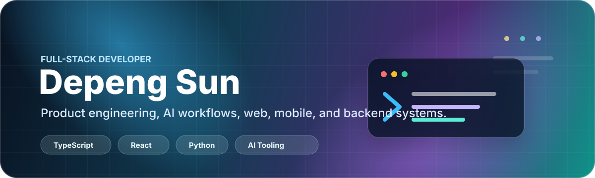

  

  <strong>Full-stack product engineer building practical web, mobile, backend, automation, and AI systems.</strong>

  <a href="mailto:shangguming@gmail.com">Email</a> ·
  <a href="https://github.com/sguming">GitHub</a>

## About

I turn product ideas into useful, maintainable systems—connecting interfaces, APIs, data flows, automation, deployment, and real-world behavior.

- Build web and mobile products around clear user workflows
- Design backend APIs, data models, authentication, and deployment pipelines
- Prototype AI-assisted product workflows and developer tooling
- Solve commerce, operations, maps, and location-based product problems

## Current Focus

- Shipping AI-assisted product workflows
- Building commerce and operations systems
- Designing mobile-first user experiences
- Automating repetitive developer and business processes

## Open To

`Full-stack product engineering` · `AI workflow prototyping` · `Automation & internal tools`

## Toolbox

  <picture>
    <source media="(prefers-color-scheme: dark)" srcset="https://skillicons.dev/icons?i=ts%2Cjs%2Creact%2Cnodejs%2Cpython%2Cpostgres%2Caws%2Cdocker&amp;theme=dark&amp;perline=8">
    <source media="(prefers-color-scheme: light)" srcset="https://skillicons.dev/icons?i=ts%2Cjs%2Creact%2Cnodejs%2Cpython%2Cpostgres%2Caws%2Cdocker&amp;theme=light&amp;perline=8">
    
  </picture>

  TypeScript · JavaScript · React · Node.js · Python · PostgreSQL · AWS · Docker

## Selected Public Work

### [leetcode-sdp](https://github.com/sguming/leetcode-sdp)

Python solutions for selected LeetCode problems, organized by problem and implementation approach.

`Python` · `Hash tables` · `Two pointers` · `Sliding windows`

> Most production and client work lives in private repositories; this profile focuses on public practice and reusable tooling.

## GitHub Activity

  <picture>
    <source media="(prefers-color-scheme: dark)" srcset="https://github-profile-summary-cards.vercel.app/api/cards/profile-details?username=sguming&amp;theme=github_dark">
    <source media="(prefers-color-scheme: light)" srcset="https://github-profile-summary-cards.vercel.app/api/cards/profile-details?username=sguming&amp;theme=github">
    
  </picture>

## How I Work

> **Build small → verify real behavior → learn from feedback → keep it maintainable.**

  

