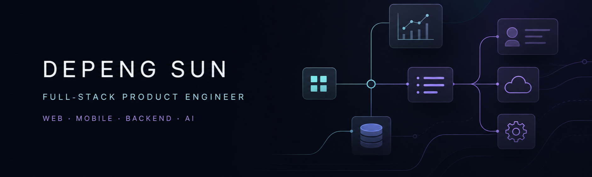

  

  <a href="mailto:shangguming@gmail.com">Email</a>

## About

I build practical product systems that connect interfaces, APIs, data, automation, and real-world operations.

- Ship web and mobile products around clear user workflows and measurable outcomes
- Design backend APIs, data models, authentication, integrations, and delivery pipelines
- Prototype AI-assisted workflows, commerce operations, and developer tooling

**Now:** Shipping AI-assisted product workflows and improving commerce operations tooling.

**Open to:** `Full-stack product engineering` · `AI workflow prototyping` · `Automation & internal tools`

## Public Practice

### [leetcode-sdp](https://github.com/sguming/leetcode-sdp)

Python solutions for selected LeetCode problems, with runnable examples and an approach-focused problem index.

`Python` · `Hash tables` · `Two pointers` · `Sliding windows`

> Public repositories focus on reusable engineering patterns, experiments, and learning notes. Client and production code remains private by design.

## Toolbox

  <picture>
    <source media="(prefers-color-scheme: dark)" srcset="https://skillicons.dev/icons?i=ts%2Cjs%2Creact%2Cnodejs%2Cpython%2Cpostgres%2Caws%2Cdocker&amp;theme=dark&amp;perline=8">
    <source media="(prefers-color-scheme: light)" srcset="https://skillicons.dev/icons?i=ts%2Cjs%2Creact%2Cnodejs%2Cpython%2Cpostgres%2Caws%2Cdocker&amp;theme=light&amp;perline=8">
    
  </picture>

  TypeScript · JavaScript · React · Node.js · Python · PostgreSQL · AWS · Docker

## How I Work

> **Build small → verify real behavior → learn from feedback → keep it maintainable.**
