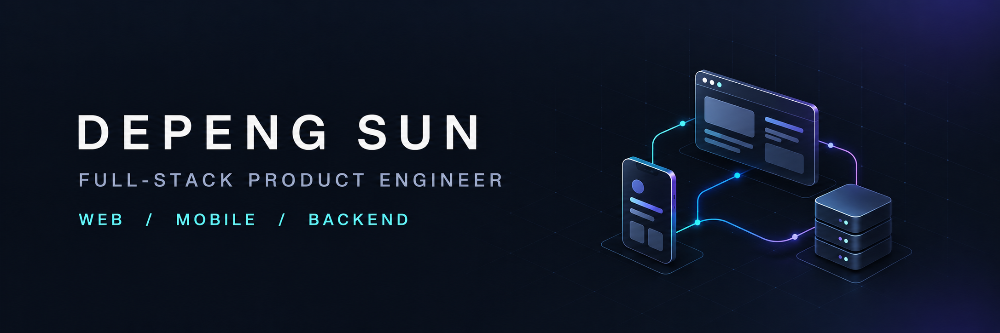

  

  <a href="mailto:shangguming@gmail.com">Email</a> &nbsp;·&nbsp;
  <a href="https://app.windmarket.top">WindMarket</a> &nbsp;·&nbsp;
  <a href="./notes/reliable-log-ingestion.md">Engineering note</a>

I build **web and mobile products**, and the **APIs and operational tools** behind them. My work spans commerce workflows, product localization, and hands-on observability—with attention to what happens when requests fail, events repeat, or sessions expire.

## Selected work

### WindMarket · Prediction market frontend

A localized product built on [Kuest](https://github.com/kuest/prediction-market). My work focuses on branding, Chinese localization, learning resources, deployment workflows, and frontend integration.

**Next.js · TypeScript · React · Vercel** 
[Explore the product](https://app.windmarket.top) · [Public Kuest fork](https://github.com/sguming/prediction-market)

The public repository tracks Kuest upstream. WindMarket-specific product work also lives outside that fork; the underlying market infrastructure is Kuest's.

### DispatchAI · Team contribution

Contributed to the frontend and backend of a service-dispatch platform covering bookings, customer calls, and calendar workflows. The public repositories show my earlier work on an application that connects a web dashboard with business APIs and AI services.

**Next.js · NestJS · TypeScript · MongoDB** 
[Frontend](https://github.com/Dispatch-AI-com/frontend) · [Backend](https://github.com/Dispatch-AI-com/backend)

### Commerce systems · Private development

Mobile storefronts, admin tools, and backend services that connect checkout, payments, orders, refunds, inventory, and delivery. Current engineering work includes payment reconciliation, duplicate callback handling, and app-to-backend flow verification.

**React Native / Expo · React · NestJS · Prisma · PostgreSQL · AWS** 
Private source; active development and validation.

### Observability lab · Docker + Elastic Stack

A local learning lab for log ingestion, malformed-event quarantine, and failed-login alerts. I traced duplicate records to file replay, added persistent checkpoints and stable event IDs, and verified the alert boundary: **five failures stayed quiet; six triggered an alert**.

**Docker · Elasticsearch · Logstash · Kibana** 
[Read the problem, fix, and recorded checks](./notes/reliable-log-ingestion.md)

## Tools I work with

| Area | Tools |
| :--- | :--- |
| Web & mobile | TypeScript, React, Next.js, React Native, Expo |
| Backend & data | Node.js, NestJS, PostgreSQL, Prisma, Python |
| Delivery & observability | AWS, Docker, GitHub Actions, Vercel, Elastic Stack |

I use AI-assisted development to investigate, implement, and review changes, then check the result with focused tests and running applications. I care about reproducible fixes, clear ownership of system state, and verification across the full user flow.

For algorithm practice: [**leetcode-sdp**](https://github.com/sguming/leetcode-sdp)—Python solutions with runnable examples and time/space complexity notes.

## Let's build something useful

Open to collaboration on **web and mobile products, business systems, and automation tools**. [Get in touch by email](mailto:shangguming@gmail.com) with the problem you're working on.

中文简介

我是 Depeng Sun，做 Web、移动端与后端开发。目前主要围绕业务系统、产品本地化和自动化工具开展工作，关注支付、订单、库存、配送这些流程能否真正衔接起来，也在实践日志分析与告警验证。

我会用 AI 辅助开发，也会通过测试、运行中的应用和实际业务流程检查结果。欢迎交流产品开发、业务系统与工具合作。

